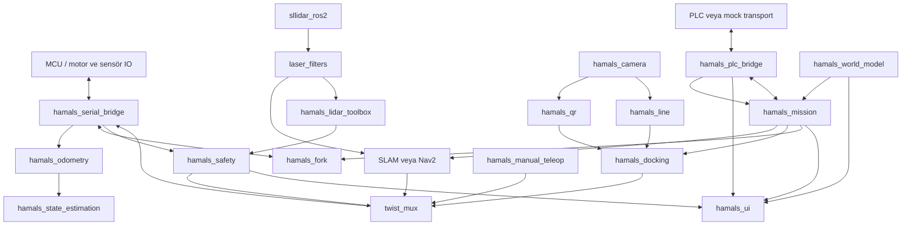

# HAMAL AGV

HAMAL, ROS 2 Humble tabanlı otonom forklift/AGV yazılımıdır. Sistem; semantik saha modeli, Nav2 navigasyon, QR ve çizgiyle hassas yanaşma, fork kontrolü, PLC görev alışverişi, bağımsız safety kilidi ve operatör arayüzünü tek bir config-driven mimaride birleştirir.

Bu depodaki ana tasarım kuralı şudur: **Her veri ve kararın tek bir sahibi vardır.** Koordinatlar world model'de, görev sırası mission'da, PLC protokolü PLC bridge'de, hassas hareket docking'de, hareket izni safety'de tutulur. `hamals_bringup` dışındaki hiçbir paket bütün sistemi kendi başına orkestre etmez.

## Mimari özet



### Hareket yetkisi

Nav2, docking ve manuel kontrol doğrudan `/cmd_vel` yayınlamaz. Her biri ayrı mux girişini kullanır:

```text
/cmd_vel/nav       priority 10  ─┐
/cmd_vel/docking   priority 50  ─┼─> twist_mux ─> /cmd_vel ─> serial bridge
/cmd_vel/manual    priority 100 ─┘       ▲
                                         │
/safety/lock       priority 255 ─────────┘
```

E-stop, manuel mod, engel veya bayat lidar heartbeat'i safety lock'ı aktif eder ve bütün yazılım hız kaynaklarını keser. Fiziksel E-stop ayrıca ROS'tan bağımsız donanımsal enerji kesme zincirine sahip olmalıdır.

## Paketler ve sorumlulukları

### Orkestrasyon ve karar katmanı

| Paket | Sorumluluk |
|---|---|
| `hamals_bringup` | Mapping, competition ve simulation profillerinin tek üst seviye launch sahibi. |
| `hamals_world_model` | İstasyonlar, QR eşleşmeleri, kapılar, saha koordinatları ve semantik rota grafiği. |
| `hamals_mission` | Aktif görev bağlamı, tipli durum yayını ve hiyerarşik görev akışı. |
| `hamals_safety` | E-stop, mod anahtarı, engel heartbeat'i ve fail-safe hareket izni. |
| `hamals_plc_bridge` | Dış PLC protokolünü tipli ROS görev/kapı olaylarına dönüştüren adaptör. |
| `hamals_docking` | QR doğrulama ve çizgi takibiyle sınırlı hassas pickup/dropoff hareketi. |
| `hamals_interfaces` | Paketler arası özel message, service ve action sözleşmeleri. |

### Hareket, donanım ve durum kestirimi

| Paket | Sorumluluk |
|---|---|
| `hamals_navigation` | Nav2 localization/navigation parametreleri; mission başlatmaz. |
| `hamals_manual_teleop` | Manuel hız üretir ve `/cmd_vel/manual` girişine yayınlar. |
| `hamals_serial_bridge` | MCU ile ROS arasındaki tek seri protokol sınırı. |
| `hamals_odometry` | Teker tick'lerinden `/odom_raw` üretir. |
| `hamals_state_estimation` | `/odom_raw` ile IMU'yu EKF üzerinden birleştiren tek aktif kestirim paketi. |
| `hamals_fork` | Fork komutu, limit bilgisi, MCU state'i ve keepalive yönetimi. |
| `hamals_robot_description` | URDF/xacro, frame ağacı, Gazebo model ve robot geometrisi. |

### Algılama, haritalama ve arayüz

| Paket | Sorumluluk |
|---|---|
| `sllidar_ros2` | RPLIDAR sürücüsü. |
| `hamals_lidar_toolbox` | Filtrelenmiş scan'den bölgesel engel durumu üretir. |
| `hamals_camera` | Kamera görüntüsünü yayınlar. |
| `hamals_qr` | Tipli QR kimliği, yaklaşık relatif poz, açı ve güven üretir. |
| `hamals_line` | Çizgi görünürlüğü ve yatay hata üretir. |
| `hamals_slam` | SLAM Toolbox ve haritalama konfigürasyonu. |
| `hamals_map_tools` | Harita kaydetme servisi. |
| `hamals_ui` | Mission, PLC, safety, QR ve world model durumlarını gösteren operatör arayüzü. Kontrol verisinin kaynağı değildir. |

`hamals_localization` aktif mimariye dahil değildir; aynı EKF sorumluluğunun iki kez çalışmasını önlemek için yalnız `hamals_state_estimation` kullanılmalıdır. `otonom_gorev_script` de hard-coded legacy örnektir ve üretim launch zincirine alınmaz.

## Config-driven veri sahipliği

Config dosyaları tek bir genel klasöre yığılmaz; kararın sahibi olan paketle birlikte sürümlenir:

```text
ros2_ws/src/
├── hamals_world_model/config/
│   ├── fields/industrial_field.yaml
│   └── profiles/{competition,simulation}.yaml
├── hamals_mission/config/
│   ├── mission_templates/pallet_transport.yaml
│   └── mission_policy.yaml
├── hamals_docking/config/docking_profiles.yaml
├── hamals_plc_bridge/config/{mock,competition}.yaml
├── hamals_safety/config/safety.yaml
├── hamals_navigation/config/
│   ├── nav2/nav2_params.yaml
│   └── motion_profiles.yaml
└── hamals_bringup/config/
    ├── system_profiles.yaml
    ├── twist_mux.yaml
    ├── robot_io.yaml
    └── laser_filters.yaml
```

### Saha modeli

[`industrial_field.yaml`](ros2_ws/src/hamals_world_model/config/fields/industrial_field.yaml), tüm kontrol koordinatlarını metre cinsinden `map` frame'inde tutar:

- A1–A3 pickup ve B1–B3 dropoff polygonları.
- Her istasyonun hedef, yaklaşma ve çıkış pozu.
- Beklenen QR ve docking profili.
- START noktası ve semantik rota düğümleri.
- Yönlü/çift yönlü kenarlar ve yüklü-yüksüz izinleri.
- Kapı düğümleri ve gidiş/dönüş bekleme pozları.

World model başlangıçta şemayı, polygonları, QR referanslarını, rota uçlarını, kapıları ve bütün A/B rota kombinasyonlarını doğrular. Model geçersizse görev sistemi başlatılmamalıdır. Depodaki sayısal değerler başlangıç modelidir; fiziksel çalışmadan önce ölçülmüş saha ve gerçek harita koordinatlarıyla değiştirilmelidir.

UI içindeki pixel tabanlı `topology.yaml` yalnız görüntüleme içindir ve robot kontrolünde kullanılamaz.

## Görev state machine

Mission yalnız çalışma zamanı bağlamını tutar:

- Görev, pickup ve dropoff kimlikleri.
- Üst durum ve aktif faz.
- Yük durumu.
- Aktif rota ve rota indeksi.
- Beklenen/doğrulanmış QR.
- Pause/error gerekçesi, retry ve geçen süre.
- Kullanılan world model checksum'u.

Mission; koordinat, PLC register'ı, kamera algoritması veya safety politikası saklamaz.

Bir `A2 → B1` görevinin uygulanan ana akışı:

```text
IDLE
  -> VALIDATE_TASK
  -> MOVE_EMPTY
  -> LOWER_FORK
  -> DOCK_PICKUP
  -> LIFT_LOAD
  -> MOVE_LOADED
  -> REQUEST_DOOR_OUTBOUND / WAITING_PLC
  -> DOOR CROSSING
  -> DOCK_DROPOFF
  -> LOWER_LOAD
  -> REPORT_DELIVERED
  -> REQUEST_DOOR_RETURN / WAITING_PLC
  -> RETURN_HOME
  -> REPORT_COMPLETE
  -> IDLE
```

Üst durumlar `BOOTING`, `IDLE`, `EXECUTING`, `WAITING_PLC`, `PAUSED_OBSTACLE`, `PAUSED_MANUAL`, `ERROR` ve `EMERGENCY_STOP` enumlarıyla `MissionState` üzerinden yayınlanır. Manuel moddan auto'ya dönüldüğünde mission kendiliğinden devam etmez; safety koşulları uygunken operatör `/mission/resume` çağrısı yapmalıdır.

## Temel ROS arayüzleri

Özel arayüzler [`hamals_interfaces`](ros2_ws/src/hamals_interfaces) paketindedir:

- Mesajlar: `MissionTask`, `MissionState`, `QrDetection`, `PlcState`, `SafetyState`, `WorldModelState`, `Station`, `Door`, `DoorEvent`.
- Action'lar: `ExecuteMission`, `Dock`.
- Servisler: `PauseMission`, `ResumeMission`, `GetStation`, `GetDoor`, `PlanSemanticRoute`.

Başlıca runtime uçları:

| Uç | Tür | Açıklama |
|---|---|---|
| `/plc/mission_task` | Topic | PLC bridge'den yeni görev. |
| `/mission/state` | Topic | UI ve izleme için tipli görev durumu. |
| `/mission/execute` | Action | PLC dışı tipli görev başlatma yolu. |
| `/mission/pause`, `/mission/resume` | Service | Operatör kontrollü duraklat/devam. |
| `/world_model/state` | Topic | Aktif saha profili ve checksum. |
| `/world_model/get_station` | Service | İstasyon geometrisi ve docking bağı. |
| `/world_model/plan_route` | Service | Semantik rota hesabı. |
| `/dock` | Action | Hassas pickup/dropoff. |
| `/safety/state`, `/safety/lock` | Topic | Güvenlik görünümü ve mux kilidi. |
| `/plc/state`, `/plc/door_event` | Topic | PLC bağlantısı ve kapı izni. |

Karar katmanında ayrıştırılması gereken JSON veya genel `std_msgs/String` yerine enum ve tipli arayüzler kullanılır. `/switch/mode` mevcut MCU sınırında string olarak kalır; safety bunu tipli `SafetyState` durumuna dönüştürür.

## Launch profilleri

Bütün üst seviye çalıştırmalar `hamals_bringup` üzerinden yapılır.

### Competition

Gerçek robot IO, EKF, Nav2, lidar obstacle processor, vision, fork, world model, docking, PLC bridge, safety, mux, mission ve UI zinciridir:

```bash
ros2 launch hamals_bringup competition.launch.py
```

Yardımcı argümanlar:

```bash
ros2 launch hamals_bringup competition.launch.py \
  with_hardware:=true \
  with_vision:=true \
  with_ui:=true \
  world_profile:=/absolute/path/to/profile.yaml \
  plc_config:=/absolute/path/to/plc.yaml \
  map:=/absolute/path/to/map.yaml
```

Varsayılan PLC transport mock'tur. Test görevi:

```bash
ros2 service call /plc/mock/submit_task std_srvs/srv/Trigger '{}'
```

### Mapping

Robot IO, lidar filtreleri, EKF/SLAM, obstacle processor, safety, mux, manuel kontrol ve map save server'ı başlatır:

```bash
ros2 launch hamals_bringup mapping.launch.py
```

### Simulation

Gazebo robot modelini, simulation world model profilini, mock PLC'yi ve gerçek kontrol düzlemini başlatır:

```bash
ros2 launch hamals_bringup simulation.launch.py
```

Mevcut simulation profili kontrol düzlemi entegrasyonu içindir. Tam uçtan uca görev tamamlamak için simüle lidar/odom, QR, çizgi ve fork state üreticilerinin robot modeline bağlanması gerekir; bu sensör simülasyonları henüz tamamlanmış değildir.

## Kurulum ve build

### Linux / geliştirme container'ı

```bash
git clone https://github.com/m-gnr/hamal_agv.git
cd hamal_agv
bash scripts/aliases.sh
source ~/.bashrc
h cdev
h cbuild
```

`sllidar_ros2` içindeki üretici SDK'sı Linux sistem çağrılarına bağlıdır ve macOS'ta derlenmez. macOS geliştirmesinde kontrol/algoritma paketlerini seçerek derleyin; lidar sürücüsünün tam build ve donanım testi Linux container veya Raspberry Pi üzerinde yapılmalıdır.

### macOS / RoboStack Conda

```bash
git clone https://github.com/m-gnr/hamal_agv.git
cd hamal_agv
conda env create -f environment.yml
conda activate ros2
bash scripts/aliases.sh
source ~/.zshrc
h cbuild
```

Standart colcon akışı:

```bash
cd ros2_ws
rosdep install --from-paths src --ignore-src -r -y
colcon build --symlink-install
source install/setup.bash
```

`h`, tüm HAMALS CLI yardımını; `h help <komut>` ilgili komutun ayrıntısını gösterir. Sık kullanılanlar:

```bash
h cbuild
h cbuild hamals_world_model
h crun
h claunch hamals_bringup
h ctopic
h cstatus
h cdoctor
```

## Test ve mimari kabul kontrolü

```bash
cd ros2_ws
colcon test
colcon test-result --verbose
```

Bir release veya saha testi öncesinde ayrıca şunlar doğrulanmalıdır:

- Yalnız `hamals_state_estimation` EKF'i aktiftir.
- Mission'ı navigation değil yalnız bringup başlatır.
- Nav2, docking, teleop ve UI doğrudan `/cmd_vel` yayınlamaz.
- Competition profilinde vision ve lidar obstacle processor otomatik başlar.
- Geçersiz world model node başlangıcını ve görev kabulünü engeller.
- Dokuz A1–A3 × B1–B3 kombinasyonunun yüklü/yüksüz rotası bulunur.
- Engel, E-stop ve heartbeat kaybı mux çıkışını kilitler.
- Manuelden auto'ya dönüş operatör resume'u olmadan hareket başlatmaz.
- QR, çizgi, fork, Nav2, PLC ve safety hataları tipli durumlarla görünürdür.
- Docking konum/yön toleransları ve rota sapması gerçek saha ölçümüyle kabul edilir.

## Sahaya hazır olmadan önce tamamlanacaklar

- Resmî PLC protokol transport'unu `hamals_plc_bridge` içinde uygulamak.
- `industrial_field.yaml` koordinatlarını ölçülmüş saha ve güncel haritayla kalibre etmek.
- MCU'nun `$SAFETY,t_us,estop,manual*CS` frame'ini fiziksel girişlerden ürettiğini doğrulamak.
- Donanımsal E-stop enerji kesme zincirini ROS'tan bağımsız test etmek.
- Docking hız/kazanç/mesafe ve nihai konum-yön toleranslarını düşük hızla kalibre etmek.
- Docking controller'da `QrDetection` relatif poz/yaw alanlarını kullanıp `Dock` sonucundaki konum ve yön hatalarını gerçekten hesaplamak; mevcut ilk sürüm QR kimliği, çizgi hatası ve odometrik mesafeyi kullanır.
- Manuelden auto'ya geçiş sırasında aktif Nav2/Dock action'ını iptal etmek veya mux kilidini operatör resume'una kadar latch etmek; mevcut mission latch'i yeni faz başlamasını engeller fakat uçuş halindeki action için ayrıca saha kabul testi gerekir.
- Mission'ın teslim ve görev tamamlandı olaylarını PLC bridge'e ayrı tipli bildirimler olarak bağlamak; mevcut bridge görev alma ve kapı izni akışını tamamlar.
- Son `ERROR`/tamamlanma durumunu UI okuyana kadar kalıcı tutmak veya ayrı görev geçmişi yayınlamak.
- Simulation için eksik sensör ve fork state üreticilerini tamamlamak.
- `sllidar_ros2` sürücüsünü hedef Linux/Raspberry Pi imajında derleyip cihazla doğrulamak.
- Dokuz görev kombinasyonunu fault injection ile birlikte uçtan uca test etmek.

Ayrıntılı paket içi belgeler için ilgili `README.md` dosyalarına, mimari karar özeti için [`docs/architecture.md`](docs/architecture.md) dosyasına bakın.
